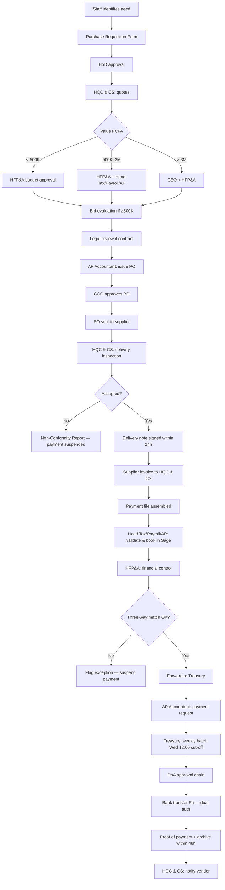

# Intel HRC — Accounting Department Reference

**Client:** Intel HRC (Payroll & Employment Services)  
**Prepared by:** Navari Systems  
**Source:** *INTEL HRC SOP's.pdf* — Accounting & Finance Manual (V1, 21 Jan 2026), Payments SOP (V1.0), Procurement Manual (V1.0), Payroll SOP, Budgeting & Forecasting SOP  
**Purpose:** Foundation document for designing an automated AP Accounting AI workflow on **Sage**, **Excel**, and **Outlook**  
**Companion:** [AP Accountant Task Register](./ap-accountant-tasks.md) — daily, weekly, and monthly current tasks

---

## 1. Executive Summary

Intel HRC's finance function operates under **SYSCOHADA / OHADA** accounting standards and **ISO 9001** quality controls. Accounts Payable is not a standalone process — it sits at the intersection of **Procurement**, **Payments**, **Treasury**, **Tax**, and **Payroll** SOPs.

The current stack is manual and fragmented:

| Platform | Current role |
|----------|--------------|
| **Sage** | General ledger, supplier ledger, payroll (Sage Paie), invoice booking |
| **Excel** | Reconciliations, payment schedules, exception logs, annex templates, contract trackers |
| **Outlook** | Invoice receipt, approval routing, schedule distribution, vendor/client notifications |

**Automation priority:** The vendor invoice-to-payment cycle — requisition → PO → delivery → three-way match → Sage booking → weekly payment run → archive — is the highest-value AP workflow. It touches all three platforms and multiple approvers.

---

## 2. Regulatory & Accounting Framework

| Element | Standard |
|---------|----------|
| Accounting framework | SYSCOHADA (OHADA Uniform Act on Accounting) |
| Quality management | ISO 9001 |
| Chart of accounts | Official SYSCOHADA classes 1–8 |
| VAT (services) | Cash basis — output VAT due on client receipt; input VAT deductible on supplier payment |
| FX | Commercial bank rate on transaction date; unrealized gains not in P&L (OHADA); losses provisioned |
| Record retention | Minimum **10 years** (accounting, procurement, payment files) |
| Segregation of duties | Mandatory — no single person controls an entire transaction |

### Key GL account classes (AP-relevant)

| Class | Use |
|-------|-----|
| **40xx** | Suppliers (4011 invoices received, 4012 group companies, 4091 advances, 4081 accrued liabilities) |
| **44xx** | Tax (445x recoverable VAT, 447x withholding tax, 444x VAT payable) |
| **51xx / 52xx** | Bank accounts (5121 local, 5211 foreign currency) |
| **60xx–63xx** | Purchases and operating expenses |
| **46xx** | Intercompany current accounts |
| **47xx** | Suspense / client disbursements |
| **67xx / 77xx** | Realized FX loss / gain |
| **478xx / 479xx** | Unrealized FX loss / gain |

---

## 3. Organization & Roles

### 3.1 Leadership & oversight

| Role | Name (per SOP sign-off) | AP-relevant responsibilities |
|------|-------------------------|------------------------------|
| **CEO** | D.N Fonderson | Final approval: POs/contracts > 3M FCFA; emergency payments; high-value one-offs |
| **CFO** | Enow Mengotkpa | Final approval of financial statements; tax/payment escalations; access control review |
| **COO** | — | Approves all operational POs; signs one-off payment memos within DoA |

### 3.2 Finance department structure

| Role | Primary AP responsibilities |
|------|----------------------------|
| **Head of Tax, Payroll & AP** (Christelle Tamen) | Reviews AP/tax entries; validates payroll journals; oversees statutory remittances; reviews supplier payment sheets; co-approves procurement 500K–3M FCFA |
| **Head of Financial Planning & Analysis (HFP&A)** | Budget validation; payment approval within thresholds; month-end close coordination; procurement planning oversight |
| **Head of Revenue & Treasury** | Executes payments after DoA approval; cash position review; payment platform efficiency; monthly exception log review |
| **AP Accountant** | Issues POs; three-way match (invoice + PO + delivery note); books invoices in Sage; reconciles vendor statements; prepares payment requests |
| **Treasury Accountant** | Weekly payment runs; disbursement batches; bank transfers (dual auth); payment file archiving within 48h |
| **Finance Officer** | Reviews standard journal entries; prepares tax/accrual entries; maintains exception register |
| **Tax Officer** | Tax declarations; WHT schedules; VAT reconciliation |
| **Payroll Specialist** | Runs Sage Paie; extracts payslips and payment orders |
| **Senior Accountant** | Intercompany reconciliation adjustments; budget compilation support |

### 3.3 Cross-functional roles (procurement & delivery)

| Role | AP touchpoint |
|------|---------------|
| **Head of Quality Control & Central Services (HQC & CS)** | Vendor quotes, delivery inspection, invoice intake, payment file assembly, vendor notification post-payment |
| **Head of Department** | Signs purchase requisitions; validates operational need |
| **Office Manager / Country Representative** | Central document archiving; vendor statutory document updates |
| **Legal Counsel** | Contract review clearance (Annex R) within 2–3 working days |
| **IT Officer** | Pre-confirmation for IT material deliveries |

### 3.4 Approval hierarchy (segregation of duties)

```
Requestor → HoD → HQC & CS → HFP&A → [Head Tax/Payroll/AP if ≥500K] → [CEO if >3M]
    → Legal (contracts) → AP Accountant (PO) → COO (PO approval) → Supplier
    → HQC & CS (delivery) → AP Accountant (match) → Head Tax/Payroll/AP (book)
    → HFP&A (control) → Treasury (pay) → Archive
```

No approver may have participated in supplier evaluation unless a co-signatory is added (Annex L). Approval authority is personal and cannot be informally delegated.

---

## 4. Technology Landscape

### 4.1 Sage 100 Online

- **Product:** Sage 100 Online (cloud-hosted)
- **Data exchange format:** `.txt` flat-file import/export using **journal codes** as the primary key
- **Import:** Tina-Randa prepares `.txt` files locally and imports them into Sage 100 Online — each file is tagged with a journal code (e.g. `ACH` for purchases, `BQ` for bank, `OD` for miscellaneous)
- **Export:** Sage 100 Online exports `.txt` files for reconciliation, aging reports, and trial balance extraction
- **Sage Paie:** Payroll processing, DIPE, payslip generation, statutory payment orders (separate module)
- **Integration needs:** Automated `.txt` file generation from validated invoices, PO numbering, payment journal entries, supplier statement reconciliation, subsidiary ledger (Class 40) vs GL reconciliation

### 4.2 Excel

Current Excel-based artifacts (automation candidates):

| Artifact | SOP reference | Owner |
|----------|---------------|-------|
| Payment Checklist | Payments Annex A | AP Accountant |
| Disbursement Schedule | Payments Annex B | Treasury Accountant |
| Central Payment Archive Register | Payments Annex C | Treasury Accountant |
| Payment Exception Log | Payments Annex C1 | Treasury Accountant |
| Contract Tracker | Procurement Annex J | HQC & CS |
| Bid Evaluation Matrix | Procurement Annex C | HQC & CS + End User |
| Supplier payment sheet | Procurement | Head Tax/Payroll/AP |
| Month-end reconciliation templates | Accounting Manual §8 | HFP&A format |
| Exception Register | Accounting Manual §15 | Finance Officer |
| AP calendar | Payments §6 | AP / Treasury |

### 4.3 Outlook

- Invoice and quote email intake
- Payroll schedule distribution (CSE → Finance)
- Payment proof sharing (Treasury → stakeholders)
- Vendor payment notifications (HQC & CS)
- Approval request routing (currently manual)
- Ethics/whistleblowing: ethics@intelhrc.org

### 4.4 Other systems referenced

- **SharePoint:** Procurement archive access log (Annex N), contract file upload post-legal clearance
- **Banking platform:** Dual-authorization payment execution

---

## 5. End-to-End AP Workflow

### 5.1 Process map



### 5.2 Procurement thresholds

| Value (FCFA) | Method | Approver(s) |
|--------------|--------|-------------|
| < 100,000 | Direct purchase (electronic payment only) | HFP&A |
| 100,000 – 499,999 | Minimum 1 written quote | HFP&A |
| 500,000 – 3,000,000 | Quotes + PO | Head Tax/Payroll/AP + HFP&A |
| > 3,000,000 | Quotes + PO + supplier countersignature | CEO (+ HFP&A) |

**PO/contract approval (Step 6.2):**

| Value (FCFA) | PO approver |
|--------------|-------------|
| 100,000 – 499,999 | HFP&A |
| 500,000 – 3,000,000 | Head Tax/Payroll/AP + HFP&A |
| > 3,000,000 | CEO |

**Rule:** No goods/services delivered without authorized PO or contract (CEO written exception only).

### 5.3 Invoice validation — three-way match

Before payment, the AP Accountant must confirm:

1. **PO/Contract** ↔ **Delivery note** ↔ **Supplier invoice** consistency
2. Supplier NIU and legal name match accreditation records
3. Valid signed delivery note (mandatory — no invoice approved without it)
4. IT deliveries require IT Officer pre-confirmation

**Payment file minimum contents:**

- Original supplier invoice
- Signed delivery note
- Approved PO or contract
- Supporting quotes / bid evaluation (if applicable)
- Legal clearance (Annex R, if contract)

### 5.4 Sage booking — vendor transactions

#### Services invoice (11.1.1)

| Dr | Cr |
|----|-----|
| 61xx / 62xx / 63xx — Service charges | |
| 445x — Recoverable VAT | |
| | 4011 — Suppliers – Invoices Received |

**Prepared by:** AP Accountant | **Reviewed by:** Finance Officer

#### Goods invoice (11.1.2)

| Dr | Cr |
|----|-----|
| 60xx — Purchases (net) | |
| 445x — Recoverable VAT | |
| | 4011 — Suppliers – Invoices Received |

#### Standard supplier payment (11.1.3)

| Dr | Cr |
|----|-----|
| 4011 — Suppliers (gross incl. VAT) | |
| | 5121 — Bank |

**Prepared by:** Treasury Accountant | **Reviewed by:** Finance Officer

#### Supplier payment with withholding tax (11.1.4)

| Dr | Cr |
|----|-----|
| 4011 — Suppliers (gross) | |
| | 5121 — Bank (net paid) |
| | 447x — WHT Payable |

#### Supplier advances (11.1.5)

| Dr | Cr |
|----|-----|
| 4091 — Supplier Advances | |
| | 5121 — Bank |

#### Clearing supplier advances (11.1.6)

| Dr | Cr |
|----|-----|
| 60xx–63xx — Expense (net) | |
| 445x — Recoverable VAT | |
| | 4091 — Supplier Advances |

#### Intercompany purchases (11.5.3 / 11.5.4)

| Dr | Cr |
|----|-----|
| 60xx / 61xx–63xx | |
| 4451 — Recoverable VAT | |
| | 4012 — Group Suppliers |

**Prepared by:** AP Accountant | **Reviewed by:** Head Tax/Payroll/AP | **Approved by:** Finance Officer

#### Accrued expenses reversal on invoice (12.1.2)

| Dr | Cr |
|----|-----|
| 4081xx — Accrued Liabilities | |
| | 4011 — Suppliers |

#### VAT cash-basis on supplier payment (11.6.1 Step 4)

When supplier is paid:

| Dr | Cr |
|----|-----|
| 444x — VAT Payable | |
| | 445x — Recoverable VAT |
| 401x — Suppliers | |
| | 5211 — Bank |

---

## 6. Payments SOP — Disbursement Controls

### 6.1 Payment categories

| Category | Trigger | Key documents |
|----------|---------|---------------|
| **Vendor payments** | Approved invoice + delivery confirmation | PO, invoice, delivery note |
| **Staff reimbursements** | IWO + receipts via Head of People & Culture | Original receipts, approved IWO |
| **Statutory disbursements** | Finalized payroll summary | CNPS, PIT, payroll reconciliation |
| **One-off / emergency** | Signed justification memo | DoA approval, memo |

### 6.2 Payment approval matrix (DoA)

| Payment type | Amount (FCFA) | Approval flow | Final disburse authority |
|--------------|---------------|---------------|--------------------------|
| Procurement-linked | ≥ 500,000 | HFP&A → Head Revenue & Treasury → Treasury Accountant | HFP&A |
| Staff reimbursement | ≤ 500,000 | Head People & Culture → HFP&A → Treasury | HFP&A |
| Staff reimbursement | > 1,000,000 | Head People & Culture → HFP&A → Treasury | CEO |
| Statutory | Any | Payroll sign-off → Head Tax/Payroll/AP → Treasury | CEO |
| One-off / non-routine | > 1,000,000 | HFP&A → CEO | CEO |
| Emergency | Any | Justification memo → HFP&A → CEO | CEO |

**Emergency payments:** Require signed justification memo + joint HFP&A and CEO approval.

### 6.3 Weekly payment schedule

| Payment type | Cut-off | Execution | Notes |
|--------------|---------|-----------|-------|
| Vendor invoices | **Wednesday 12:00** | **Friday** (same week) | PO + invoice + delivery required |
| Staff reimbursements | Wednesday 12:00 | Friday | Urgent needs HFP&A approval |
| Salaries & statutory | Per payroll schedule | Per statutory due dates | See Payroll SOP |
| One-off | As approved | Within 3 business days of final approval | DoA + justification memo |

### 6.4 Payment execution & archiving

1. **Treasury Accountant** prepares batch + Disbursement Schedule (Annex B)
2. **Head Revenue & Treasury** confirms cash availability and authorizes
3. **CFO** signs off if threshold/complexity requires
4. **COO/CEO** per DoA for high-value/non-routine
5. Bank transfer via secure platform — **dual authorization**
6. Proof captured: SMS, email, bank statement, POP, debit advice
7. **Within 48 hours:** Treasury compiles payment file → central archive
8. **HQC & CS** notifies vendor (amount, reference, date)

**Payment file must include:**

- Approved invoice / IWO / memo
- PO, delivery note, receipts, payroll reconciliation
- Signed Payment Checklist (Annex A)
- Approved Disbursement Schedule (Annex B)
- Proof of payment
- Exception Log entries (Annex C1) if applicable

**Retention:** 10 years minimum. Central Payment Archive Register (Annex C) maintained by Treasury.

### 6.5 Internal controls

| Control | Requirement |
|---------|-------------|
| Maker-checker | AP initiates; Treasury executes — segregated |
| Dual authorization | All bank disbursements |
| Exception logging | Real-time updates; monthly review; escalate unresolved within 24h to HFP&A |
| Access control | Role-based; quarterly CFO review; revoked on role change |
| Reconciliation | Treasury reconciles executed payments vs approved schedule |

---

## 7. Reconciliations & Month-End (AP impact)

| Activity | Frequency | Deadline | Owner |
|----------|-----------|----------|-------|
| Subsidiary ledger reconciliation (Classes 40, 41, 46, 47, 451, 16x) | Monthly | 10th business day of following month | AP/AR/Treasury preparer → team lead review |
| Vendor statement reconciliation | Monthly | Per close calendar | AP Accountant |
| Tax account reconciliation | Monthly | Aligned with statutory declarations | Tax Officer |
| Intercompany confirmation | Monthly | Before close | Senior Accountant |
| Signed reconciliation checklist | Monthly | Before financials finalized | HFP&A coordinates |

AP automation must produce reconciliation-ready data: open invoices, unmatched POs, aging of 4011/4091, WHT accruals (447x).

---

## 8. Document & Annex Index

### 8.1 Accounting & Finance Manual annexes

| Annex | Title |
|-------|-------|
| A | Chart of Accounts |
| B | Journal Entry Template |
| C | Reporting Checklist and Calendar |
| D | Month-End and Year-End Closing Checklist |
| E | Change Log |

### 8.2 Payments SOP annexes

| Annex | Title |
|-------|-------|
| A | Payment Checklist |
| B | Disbursement Schedule Template |
| C | Central Payment Archive Register |
| C1 | Payment Exception Log |
| D | Delegation of Authority Chart |

### 8.3 Procurement Manual annexes (AP-critical)

| Annex | Title | Automation priority |
|-------|-------|---------------------|
| A | Purchase Requisition Form | High — workflow trigger |
| B | Supplier Quotation Template | Medium |
| C | Bid Evaluation Matrix | High — ≥500K FCFA |
| D | Procurement Process Flowchart | Reference |
| E | Delegation of Authority Chart | High — routing logic |
| F | Supplier Compliance Checklist | High — vendor onboarding |
| G | Vendor Performance Evaluation Form | Medium |
| H | Supplier Onboarding & Registration Checklist | High |
| I | Preferred Supplier List Format | High |
| J | Contract Management & Renewal Tracker | High — quarterly review |
| K | Single Source Justification Template | Medium |
| L | Purchase Order Template | High — sequential numbering |
| M | Delivery Note Template | High — mandatory for payment |
| N | Archive Access Log Template | Medium |
| O | Conflict of Interest & Gift Declaration | Compliance |
| P | Whistleblowing Incident Reporting Form | Compliance |
| Q | Procurement Manual Change Log | Governance |
| R | Contract Review Clearance Template | High — legal gate |

---

## 9. Exception Handling

| Severity | Resolution SLA | Escalation |
|----------|----------------|------------|
| Minor (delayed sign-off, coding error) | 2 business days | Preparer/reviewer → HFP&A if unresolved |
| Material / repeated / fraud risk | 1 business day | CFO → Executive Management |
| Payment delay/rejection/missing docs | Real-time log | Head Revenue & Treasury → HFP&A within 24h |
| Delivery non-conformity | Until resolved | Payment suspended; Non-Conformity Report |
| Three-way match failure | Immediate | Payment suspended; flagged to Head Tax/Payroll/AP |

**Registers:**

- **Exception Register** — Finance Officer (monthly, reviewed at close)
- **Payment Exception Log (Annex C1)** — Treasury (real-time)
- **Payroll Exception Log (Annex E)** — Payroll SOP

---

## 10. Cross-SOP Dependencies

| Upstream SOP | Downstream effect on AP |
|--------------|-------------------------|
| **Procurement Manual** | PO authorization, delivery evidence, vendor accreditation |
| **Payments SOP** | Weekly run, DoA, archiving |
| **Payroll SOP** | Statutory payment triggers; Head Tax/Payroll/AP review chain |
| **Billing SOP** | Client-billable disbursements (471x suspense) |
| **Budgeting SOP** | HFP&A budget validation at requisition stage |

If SOPs conflict on payment authorization, **DoA thresholds in Payments SOP §5.3 prevail**.

---

## 11. AI Workflow Design — Automation Blueprint

This section translates the SOP into automation modules. Each module maps to Sage + Excel + Outlook integration points.

### Module 1: Invoice intake & classification

**Trigger:** Email to AP/shared mailbox (Outlook) or upload to procurement folder  
**AI actions:**

- Extract: supplier name, NIU, invoice number, date, line items, VAT, total, currency
- Classify: services vs goods vs intercompany vs fixed asset
- Match to open PO by supplier + amount + reference
- Flag: unknown supplier, missing PO, duplicate invoice number

**Output:** Structured invoice record → Excel tracker row + Sage `.txt` import file (journal code tagged)

### Module 2: Three-way match engine

**Inputs:** Invoice (OCR/PDF) + PO (Sage/Annex L) + Delivery note (Annex M)  
**Rules:**

| Check | Pass criteria |
|-------|---------------|
| PO exists & approved | COO sign-off on file |
| Delivery note signed | HQC & CS signature within 24h of receipt |
| Amount tolerance | Invoice ≤ PO remaining balance (configurable %) |
| Supplier identity | NIU + legal name = accreditation record |
| VAT treatment | Cash-basis flag for services |

**On fail:** Create Exception Log entry; notify AP Accountant + HQC & CS via Outlook; block payment queue

### Module 3: Approval routing (DoA)

**Logic engine inputs:** Payment type, amount (FCFA), category, urgency flag  
**Actions:**

- Build approval chain from §6.2 matrix
- Send Outlook approval requests with embedded checklist
- Track timestamps against Wednesday 12:00 cut-off
- Escalate if approver non-responsive within SLA

### Module 4: Sage posting

**On approval:**

- Generate `.txt` import file per §5.4 mapping (4011, 445x, 60xx–63xx) with correct journal code
- Tina-Randa reviews generated file → imports into Sage 100 Online
- Update supplier sub-ledger
- Link supporting docs to transaction reference
- For VAT services: hold 445x deduction until payment event (Step 4)

### Module 5: Weekly payment batch

**Schedule:**

- **Monday–Tuesday:** Collect validated payment files
- **Wednesday 12:00:** Cut-off — compile Disbursement Schedule (Annex B)
- **Wednesday PM:** Approval chain completion
- **Thursday:** Treasury review + cash confirmation
- **Friday:** Execute transfers (dual auth) + capture POP

**Excel output:** Annex B populated from Sage open payables; Annex A checklist auto-generated

### Module 6: Archive & notification

**Within 48h of payment:**

- Assemble payment file (§6.4)
- Index: Year / Supplier / Transaction reference
- Update Central Payment Archive Register (Annex C)
- Send vendor notification (Outlook template: amount, reference, date)
- Sync to SharePoint procurement archive

### Module 7: Reconciliation assist

**Monthly (by 10th business day):**

- Pull Sage Class 40 balance vs AP sub-ledger
- Match against vendor statements (uploaded/email)
- Age unmatched items; propose accruals (4081xx) or adjustments
- Generate signed checklist draft for HFP&A

---

## 12. Key Metrics & SLAs (for workflow monitoring)

| Metric | Target |
|--------|--------|
| Invoice booking cycle time | ≤ 2 business days from validated payment file |
| Three-way match auto-pass rate | Track baseline; target > 80% straight-through |
| Payment cycle (validated → paid) | ≤ 5 business days (within weekly Fri run) |
| Exception resolution | Minor: 2 days; Material: 1 day escalation |
| Archive completion | 48h post-payment |
| Reconciliation completion | 10th business day |
| Wednesday cut-off compliance | 100% of ready files in batch |

---

## 13. Open Items for Discovery

Items to confirm with Intel HRC during workflow build:

1. ~~**Sage version/edition**~~ → **Confirmed: Sage 100 Online**, `.txt` import/export with journal codes
2. **Sage `.txt` format** — exact column layout, delimiter, encoding, sample file needed
3. **Journal codes in use** — full list (e.g. ACH, BQ, OD, VE, etc.) and which Tina-Randa uses for AP
4. **Current Excel template locations** and which annexes are actively used vs aspirational
5. **Outlook mailbox structure** — shared inboxes, approval email patterns
6. **CFO validation flow** — how Enow currently receives items for sign-off (email? in person?)
7. **Banking platform** name and export format for reconciliation
8. **SharePoint site** structure for procurement archive
9. **Active entity/jurisdiction** — OHADA member state for tax rule specifics
10. **Volume benchmarks** — invoices/month, suppliers, average processing time today
11. **Preferred Supplier List** — current state and accreditation data format

---

## 14. Document Control

| Field | Value |
|-------|-------|
| Navari reference | `projects/intel-hrc/docs/accounting-department.md` |
| Source document | `projects/intel-hrc/source/intel-hrc-sops.pdf` (75 pages) |
| AP task register | `projects/intel-hrc/docs/ap-accountant-tasks.md` |
| SOP version | V1 / V1.0 |
| Original approval date | 17 Feb 2026 |
| Initial release | 21 Jan 2026 |
| Next review trigger | Client discovery session + Sage/Excel/Outlook audit |

---

*This document is a Navari Systems working reference derived from client SOPs. It is intended to drive AI workflow design and is not a replacement for Intel HRC's approved internal procedures.*
