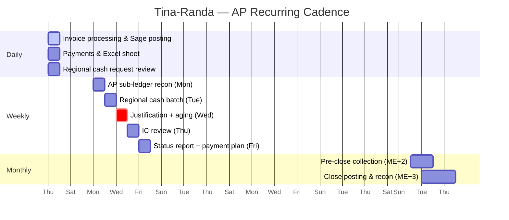

# Intel HRC — AP Accountant Task Register

**Owner:** Tina-Randa (AP Accountant)  
**Prepared by:** Navari Systems  
**Source:** `source/monthly-tasks-ap-accountant.xlsx` — Tina-Randa's task breakdown (Daily, Weekly, Monthly sheets)  
**Related:** [Accounting Department Reference](./accounting-department.md)

This document is the operational baseline for Tina-Randa's current manual workload. The automation build should target her daily and weekly repetition first, then month-end close tasks.

---

## Role & review chain

| Person | Role | Relationship to these tasks |
|--------|------|------------------------------|
| **Tina-Randa** | AP Accountant | Performs all daily and weekly tasks; executes monthly posting, reconciliation, and reporting |
| **Enow** | CFO (pre-close oversight) | Checks pre-close collection tasks (ME+2 / ME+3 document confirmation) |
| **Elvis / Francis** | Finance team (close support) | Checked-by on accounting close, reconciliation, and reporting tasks (ME+3) |

Per the SOP, Tina-Randa's AP work is reviewed by the **Finance Officer** and **Head of Tax, Payroll & AP** on journal entries; payment execution sits with **Treasury** after validation.

---

## Entity scope

Tina-Randa's tasks span **7 entities** across the group, with **6 regional offices** submitting cash requests and justifications separately.

| Scope label | Meaning |
|-------------|---------|
| All 7 entities | Group-wide close, reconciliation, and reporting |
| 6 Regional | Regional cash requests and justification collection/review |
| INTEL HRC, IOS CMR | Primary daily invoice and payment processing entities |

---

## Daily tasks — Tina-Randa

| # | Category | Task | Frequency | Entity scope | Priority | Est. time | Notes |
|---|----------|------|-----------|--------------|----------|-----------|-------|
| 1 | Invoice processing | Receive, review, validate supplier invoices for completeness and post invoices in Sage | Daily | INTEL HRC, IOS CMR | High | 1–2 hrs | Check against PO |
| 2 | Post prepayments | Post all prepayments in Sage | Daily | All 7 entities | High | 1 hr | Use standard coding |
| 3 | Payment processing | Process approved payments and prepare payment Excel sheet | Daily | INTEL HRC, IOS CMR | High | 1–2 hrs | Dual authorization |
| 4 | Documentation | File all supporting documents (invoices, receipts, approvals) | Daily | All 7 entities | Medium | 30 min | Audit trail |
| 5 | Email management | Review and respond to vendor inquiries and internal requests | Daily | All 7 entities | Medium | 30 min | Track pending |
| 6 | Cash request review | Review incoming cash requests from regional offices | Daily | 6 Regional | High | 2 hrs | Log receipt date |
| 7 | Expense verification | Verify staff claims and expense reports for compliance | Daily | All 7 entities | Medium | 3 hrs | Policy check |

**Estimated daily load:** ~9–11 hours (tasks overlap across entities; some are batchable).

---

## Weekly tasks — Tina-Randa

| # | Category | Task | Day | Entity scope | Priority | Est. time | Notes |
|---|----------|------|-----|--------------|----------|-----------|-------|
| 1 | Reconciliation | Reconcile AP sub-ledger to general ledger | Monday | All 7 entities | High | 2 hrs | Flag discrepancies |
| 2 | Vendor management | Follow up on outstanding vendor queries and disputes | Monday | All 7 entities | Medium | 1 hr | Document resolutions |
| 3 | Cash request | Process validated cash requests from regional offices | Tuesday | 6 Regional | High | 3 hrs | Batch processing |
| 4 | Justification review | Review and validate justifications from 6 regional entities | Wednesday | 6 Regional | High | 3 hrs | Cross-check requests |
| 5 | Aging analysis | Review AP aging report and prioritize payments | Wednesday | All 7 entities | High | 1.5 hrs | Links to month-end: Review AP aging reports |
| 6 | Intercompany | Review intercompany AP transactions between entities | Thursday | All 7 entities | High | 2 hrs | Prepare recon |
| 7 | Status reporting | Prepare weekly AP status report for management | Friday | All 7 entities | High | 1.5 hrs | Include KPIs |
| 8 | Payment planning | Prepare payment schedule for following week | Friday | All 7 entities | Medium | 1 hr | Cash flow check |
| 9 | Document follow-up | Follow up on missing supporting documents/approvals | Friday | All 7 entities | Medium | 1 hr | Links to month-end: Confirm supporting docs |

**Weekly cadence alignment (Payments SOP):**

| Day | SOP event | Task overlap |
|-----|-----------|----------------|
| Monday | Recon week start | AP sub-ledger reconciliation |
| Tuesday | — | Regional cash request batch |
| **Wednesday 12:00** | **Vendor payment cut-off** | Justification review + aging prioritization |
| Thursday | Intercompany review | IC AP transaction review |
| **Friday** | **Payment execution** | Status report + next-week payment schedule |

---

## Monthly tasks — Tina-Randa

Aligned to **month-end close checklist**. Deadlines use **ME+** notation (days after month-end). Tasks marked **Checked by: Enow** are pre-close collection gates; **Elvis/Francis** review close and reporting outputs.

| # | Category | Task | Deadline | Entity scope | Priority | Checked by | Related checklist task |
|---|----------|------|----------|--------------|----------|------------|------------------------|
| 1 | Pre-close | Collect ALL supplier invoices from vendors | ME+2 | All 7 entities | Critical | Enow | Collect supplier invoices and staff claims |
| 2 | Pre-close | Collect and consolidate staff claims across all entities | ME+2 | All 7 entities | Critical | Enow | Collect supplier invoices and staff claims |
| 3 | Pre-close | Collect monthly cash requests from 6 regional offices | ME+2 | 6 Regional | Critical | Enow | Regional cash request collection (AP specific) |
| 4 | Pre-close | Collect and validate ALL justifications from regional offices | ME+2 | 6 Regional | Critical | Enow | Regional justification collection (AP specific) |
| 5 | Pre-close | Confirm all supporting documents and approvals received | ME+3 | All 7 entities | High | Enow | Confirm all supporting documents and approvals received |
| 6 | Accounting close | Post ALL invoices and unrecorded liabilities | ME+3 | All 7 entities | Critical | Elvis/Francis | Post all invoices and prepayments |
| 7 | Accounting close | Post prepayments | ME+3 | All 7 entities | High | Elvis/Francis | Check all invoices posted and prepayments |
| 8 | Reconciliation | Review and analyze AP aging reports per entity | ME+3 | All 7 entities | High | Elvis/Francis | Review AP aging reports |
| 9 | Accounting close | Post ALL supplier invoices and bills | ME+3 | All 7 entities | Critical | Elvis/Francis | Post all invoices and bills (suppliers) |
| 10 | Intercompany | Record intercompany AP journal entries | ME+3 | All 7 entities | High | Elvis/Francis | Record all intercompany journal entries |
| 11 | Reconciliation | Reconcile intercompany AP balances with other entities | ME+3 | All 7 entities | High | Elvis/Francis | Reconcile intercompany accounts per subsidiary |
| 12 | Reporting | Prepare AP summary report for month-end close | ME+3 | All 7 entities | High | Elvis/Francis | Generate trial balance for each entity |

**SOP deadline cross-reference:** Accounting Manual requires subsidiary ledger reconciliations (Class 40) by the **10th business day** of the following month — monthly tasks at ME+2/ME+3 are the preparatory phase before that deadline.

---

## Workload summary — Tina-Randa

| Cadence | Task count | Estimated time |
|---------|------------|----------------|
| Daily | 7 | ~9–11 hrs |
| Weekly | 9 | ~16 hrs |
| Monthly | 12 | Concentrated ME+2 to ME+3 window |

**Highest daily load:** expense verification (3 hrs), regional cash request review (2 hrs), invoice processing + payment prep (2–4 hrs combined).

**Automation priority for Tina-Randa:** invoice intake and PO matching, payment Excel sheet generation, regional cash request logging, and weekly AP sub-ledger reconciliation.

---

## Task calendar (combined view)

---

## Automation mapping

Tasks ranked by automation ROI for the Sage / Excel / Outlook workflow build.

| Task | Cadence | Automation module | Expected impact |
|------|---------|-------------------|-----------------|
| Invoice receive, validate, post in Sage | Daily | Module 1 (intake) + Module 4 (Sage posting) | High — 1–2 hrs/day saved |
| Check against PO (three-way match) | Daily | Module 2 (match engine) | High — reduces manual validation |
| Prepare payment Excel sheet | Daily | Module 5 (weekly batch / Annex B) | High — auto-populate from Sage |
| File supporting documents | Daily | Module 6 (archive) | Medium — auto-index on post |
| Email / vendor inquiry tracking | Daily | Outlook integration + ticket log | Medium |
| Regional cash request review | Daily / Weekly | Intake form + validation rules | High — 2–3 hrs/batch |
| AP sub-ledger to GL reconciliation | Weekly | Module 7 (reconciliation assist) | High — 2 hrs/week |
| AP aging review & payment priority | Weekly | Aging dashboard from Sage | Medium |
| Payment schedule for next week | Weekly | Module 5 — ties to Wed cut-off | High |
| Missing document follow-up | Weekly | Exception log auto-reminders | Medium |
| Pre-close invoice/claim collection | Monthly | Automated chase emails + status dashboard | High |
| Post invoices & unrecorded liabilities | Monthly | Batch posting queue | High |
| IC AP entries & reconciliation | Monthly | IC matching across 7 entities | High |
| AP summary / trial balance report | Monthly | Report generation from Sage | Medium |

---

## Platform touchpoints per task type

| Platform | Tasks using it |
|----------|----------------|
| **Sage** | Invoice posting, prepayments, payment journals, aging reports, IC entries, trial balance |
| **Excel** | Payment sheet, weekly status report, payment schedule, regional cash/justification tracking |
| **Outlook** | Vendor inquiries, internal requests, document chase, approval routing |

---

## Document control

| Field | Value |
|-------|-------|
| Owner | Tina-Randa (AP Accountant) |
| Source file | `../source/monthly-tasks-ap-accountant.xlsx` |
| Sheets | Monthly Tasks, Weekly Tasks, Daily Tasks |
| Last imported | 19 Jun 2026 |
